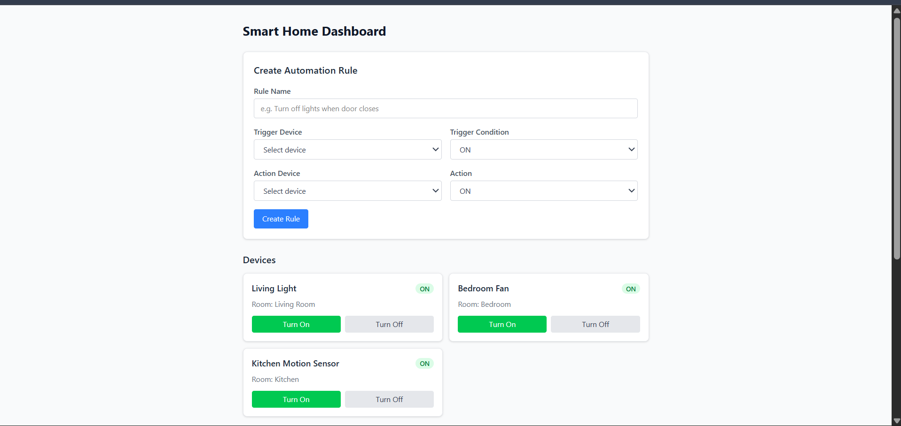

# Smart Home Dashboard

## Dashboard Screenshot



## Tech Stack

- React
- Node.js
- Express
- MongoDB

## Features

- Smart device control
- Automation rule creation
- Real-time device updates
- Automatic rule execution

## Setup

### 1. Clone the Repository

```bash
git clone https://github.com/Saurav3004/Home_Automation.git
cd Home_Automation
```

### 2. Backend Environment Variables

Create a `.env` file inside the `backend` folder:

```bash
cd backend
cp .env.example .env
```

Then open `.env` and fill in your values:

```env
PORT=5000
MONGO_URI=mongodb://localhost:27017/smarthome
```

> If you are using MongoDB Atlas, replace `MONGO_URI` with your Atlas connection string.

### 3. Backend

```bash
cd backend
npm install
npm start
```

### 4. Frontend

```bash
cd frontend
npm install
npm run dev
```

## Seed Sample Devices

```bash
cd backend
node seed.js
```

## Sample Automation

Trigger:
Kitchen Motion Sensor -> ON

Action:
Living Light -> ON